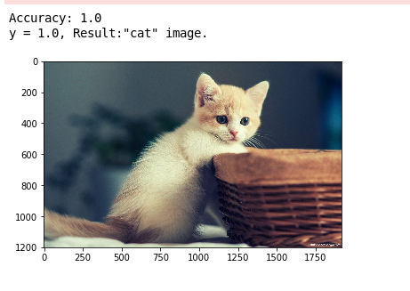

# Meow :smiley_cat:

We know that cats are extremely adorable creatures, so, this project is an image classifier that uses 4-layer neural nets to detect if it is a "cat" image or a "non-cat" image.

## Dependancies

You will need the following python packkages:

* `numpy`, the fundamental package for scientific computing with Python.
* `matplotlib`, a library to plot graphs in Python.
* `h5py`, a common package to interact with a dataset that is stored on an H5 file.
* `PIL` and `scipy` are used here to test the model with the picture.
* `jupyter notebook`

Other dependancies (functions) are defined in the dnn_app_utils.py file

## Running the tests

You will need to fork and clone my repository and install the above dependancies to get started.
Rewrite the `my_image.jpg` under the images directory with your required image.
Run the [cat_or_not.ipynb](cat_or_not.ipynb) file in your jupyter notebook and get started.:)

### My example

## Acknowledgments

* Coursera- Deep Learning specilization courses, Deeplearning.ai by Andrew Ng.
